# 🟨 PLATYNATOR – Profile & Nameplate Config

Platynator è un addon per **World of Warcraft** dedicato alla personalizzazione avanzata delle **nameplate** (unit frames sopra personaggi e nemici).  

## 📁 Contenuto del Repository

All’interno troverai i seguenti file di configurazione:

- **Profile.txt**  
  Configurazione del profilo

  [Nameplate - Profile](Profile.txt)

- **Mobs.txt**  
  Configurazioni dedicate alle **nameplate dei nemici / mob**:
  - Colori per tipo di unità
  - Evidenziazione target
  - Barre vita e risorse
  - Indicatori di pericolo o status

  [Nameplate - Mobs](Mobs.txt)

- **Players.txt**  
  Configurazioni per le **nameplate dei giocatori**:

  [Nameplate - Players](Players.txt)

## 🛠️ Configurazione Platynator

### General
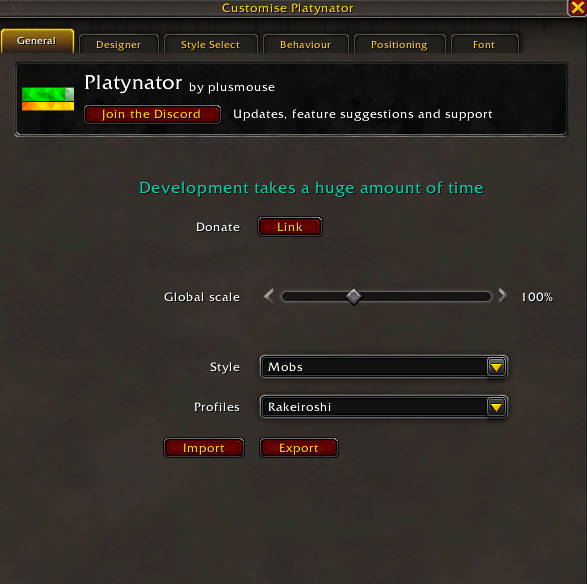

### Designer
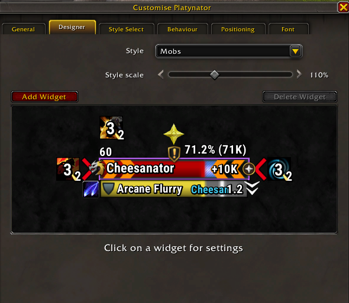

### Style Select
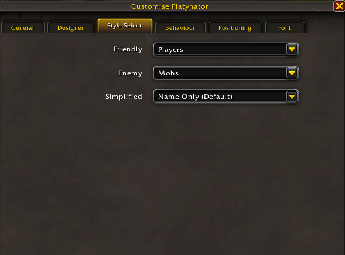

### Behaviour
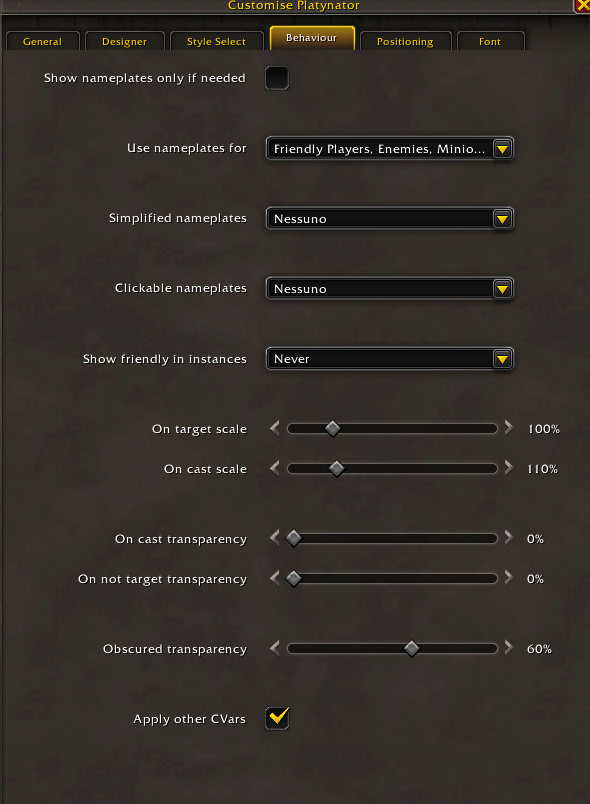

### Positioning
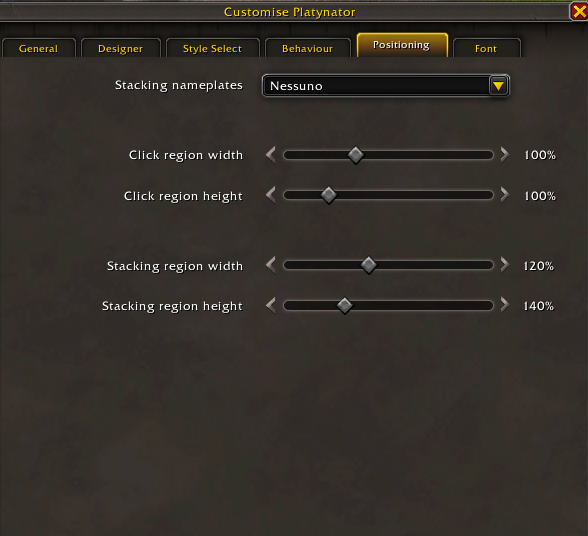

### Font
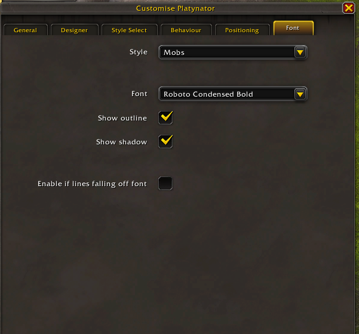

## 🎮 Configurazione World of Warcraft

### Barre 
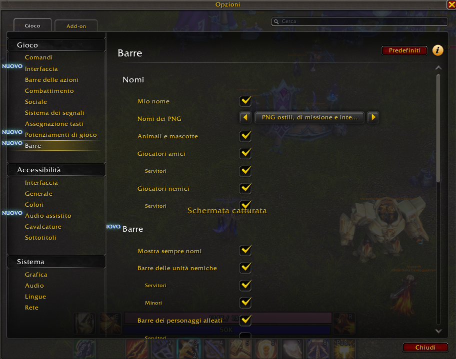

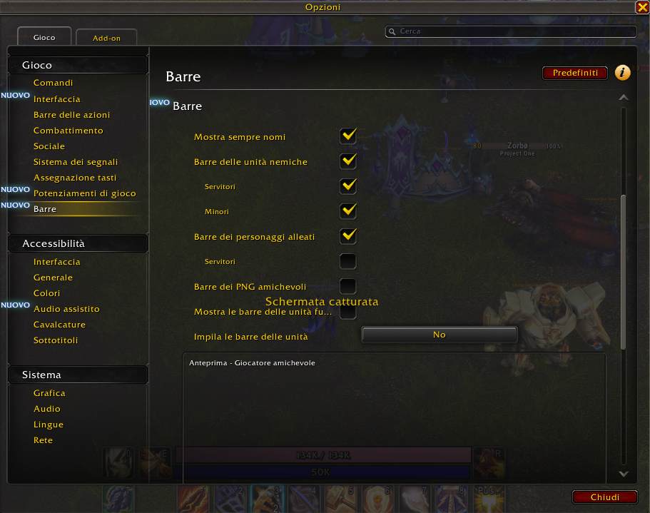

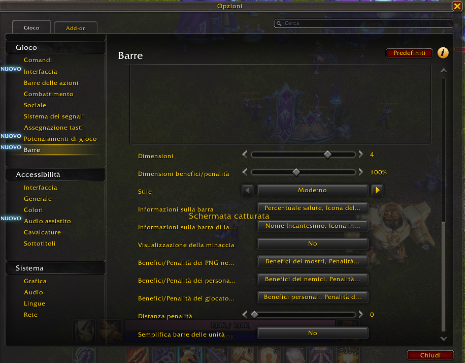

## ⚙️ Installazione

1. Assicurati di avere **Platynator** installato e aggiornato.
2. Avvia World of Warcraft e accedi al personaggio.
3. Apri le impostazioni di Platynator con:
4. Vai alla sezione **Import / Export**.
5. Copia il contenuto del file desiderato.
6. Incollalo nel campo di importazione e conferma.
7. Ricarica l’interfaccia.

## 📷 Gallery

### Interrupt - Quest
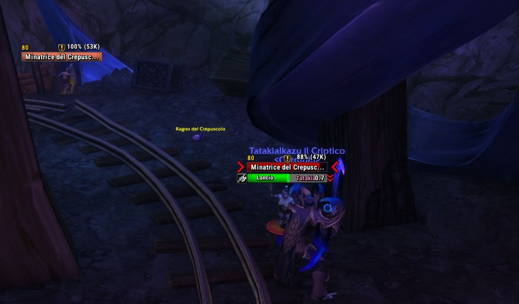

### No Interupt

### 

### Focus
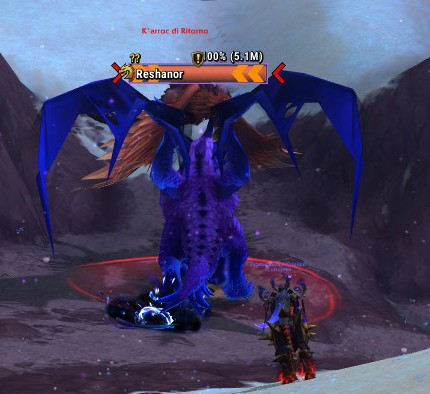
